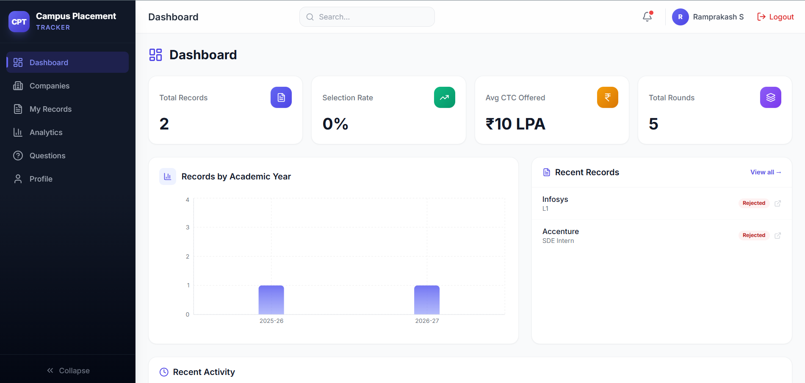
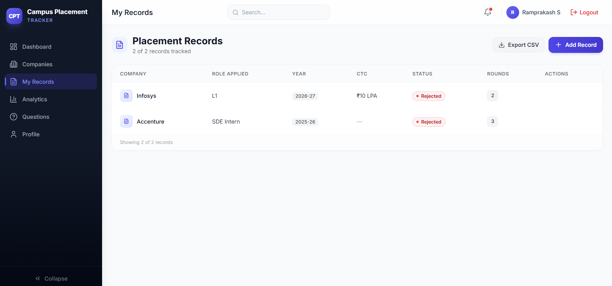
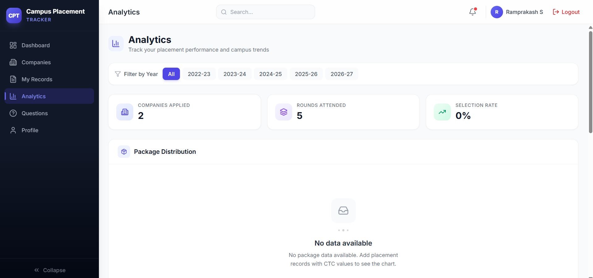

# 🎓 Campus Placement Tracker

> A full-stack web app where students log every company they face during campus placements — rounds attended, questions asked, outcomes. Built in 50 days, 50 commits.

🔗 **Live App:** [https://cpt-v1.vercel.app](https://cpt-v1.vercel.app)
📚 **API Docs:** [https://campus-placement-tracker-ezdq.onrender.com/docs](https://campus-placement-tracker-ezdq.onrender.com/docs)

---

## 📸 Screenshots

### Dashboard


### Placement Records


### Analytics



---

## ✨ Features

### For Students
- **Dashboard** — KPI cards (total records, selection rate, avg CTC, total rounds), records-by-year chart, recent activity feed
- **Placement Records** — Create, view, update, delete placement applications with status tracking
- **Interview Rounds** — Log each round (aptitude, technical, HR, coding, GD) with questions and outcomes
- **Companies** — Browse companies visiting campus, view placement history
- **Bookmarks** — Wishlist companies for quick access
- **Question Bank** — Community-contributed interview questions (anonymized by default)
- **Analytics** — Package comparison, dropout rates per round, company frequency, placement trends
- **Profile** — Update name, change password, view personal summary

### For Coordinators
- Everything students get, plus:
- **Review Records** — Approve or reject student placement entries
- **Student Management** — View all students, record counts, delete accounts
- **Platform-wide Analytics** — All students' data aggregated, not just personal

---

## 🛠 Tech Stack

| Layer | Technology |
|---|---|
| Frontend | React 19, Vite, Tailwind CSS, React Router v6 |
| Forms | React Hook Form + Zod |
| Charts | Recharts |
| State | React Query (TanStack), Context API |
| Icons | Lucide React |
| Backend | Python 3.11, FastAPI, SQLAlchemy ORM, Alembic |
| Database | PostgreSQL |
| Auth | JWT (python-jose), bcrypt, passlib |
| Rate Limiting | SlowAPI |
| Testing | pytest, httpx, TestClient (43 tests) |
| Deployment | Vercel (frontend) + Render (backend + DB) |

---

## 📁 Project Structure

```
campus-placement-tracker/
├── frontend/                   # React + Vite SPA
│   ├── src/
│   │   ├── components/         # Reusable UI components
│   │   ├── pages/              # Route pages
│   │   ├── services/           # Axios API service functions
│   │   ├── store/              # Auth + Toast context providers
│   │   └── App.jsx             # Root with routing + guards
│   ├── vercel.json             # SPA rewrite rules
│   └── index.html              # Entry with SEO meta tags
│
├── backend/                    # FastAPI REST API
│   ├── routers/                # Route handlers (12 groups)
│   ├── models/                 # SQLAlchemy ORM models
│   ├── schemas/                # Pydantic v2 schemas
│   ├── core/                   # Config, security, dependencies
│   ├── db/                     # Engine + session factory
│   ├── alembic/                # Database migrations
│   ├── tests/                  # pytest suite (43 tests)
│   ├── main.py                 # App entry point
│   ├── init_db.py              # Admin seed script
│   ├── seed_data.py            # Demo data seed
│   └── alembic_run.py          # Deployment migration runner
│
├── DEPLOYMENT.md               # Full deployment guide
└── README.md                   # This file
```

---

## 🚀 Local Setup

### Prerequisites
- Python 3.11+
- Node.js 18+ and npm
- PostgreSQL 14+ running locally

### Backend
```bash
cd backend

# Set up environment
cp .env.example .env
# Fill in DATABASE_URL, SECRET_KEY, etc.

# Install dependencies
pip install -r requirements.txt

# Run migrations
python -m alembic upgrade head

# Seed admin user
python init_db.py

# (Optional) Seed demo data
python seed_data.py

# Start server
uvicorn main:app --reload --port 8000
```

### Frontend
```bash
cd frontend

# Install dependencies
npm install

# Start dev server
npm run dev
```

App runs at `http://localhost:5173` — API at `http://localhost:8000`.

---

## 🔐 Environment Variables

### Backend (`backend/.env`)

| Variable | Description | Required |
|---|---|---|
| `DATABASE_URL` | PostgreSQL connection string | ✅ |
| `SECRET_KEY` | JWT signing secret (`openssl rand -hex 32`) | ✅ |
| `ALGORITHM` | JWT algorithm | ❌ default: `HS256` |
| `ACCESS_TOKEN_EXPIRE_MINUTES` | Token lifetime | ❌ default: `30` |
| `FRONTEND_URL` | Frontend URL for CORS | ❌ default: `http://localhost:5173` |
| `COORDINATOR_INVITE_CODE` | Secret code for coordinator registration | ❌ |
| `ADMIN_EMAIL` | Admin seed email | ❌ |
| `ADMIN_PASSWORD` | Admin seed password | ❌ |
| `SMTP_HOST` | SMTP server | ❌ default: `smtp.gmail.com` |
| `SMTP_PORT` | SMTP port | ❌ default: `587` |
| `SMTP_USER` | SMTP username | ❌ |
| `SMTP_PASSWORD` | Gmail App Password | ❌ |

### Frontend (`frontend/.env`)

| Variable | Description |
|---|---|
| `VITE_API_BASE_URL` | Backend API base URL |

---

## 📚 API Documentation

With the backend running locally:

- **Swagger UI:** http://localhost:8000/docs
- **ReDoc:** http://localhost:8000/redoc

12 endpoint groups: Auth, Users, Companies, Placement Records, Rounds, Analytics, Coordinator, Admin, Search, Bookmarks, Question Bank, Activity.

---

## 🧪 Running Tests

```bash
cd backend
python -m pytest tests/ -v
```

43 test cases covering auth, companies CRUD, record ownership enforcement, and analytics response shapes.

---

## 👤 Demo Credentials

| Role | Email | Password |
|---|---|---|
| Student | alice@campus.com | Student@123 |
| Student | bob@campus.com | Student@123 |

> Run `python seed_data.py` in the backend to create these accounts.
> Coordinator and Admin accounts are provisioned separately via invite code and `init_db.py`.

---

## 🌐 Deployment

See [DEPLOYMENT.md](./DEPLOYMENT.md) for the complete guide covering Vercel + Render setup, environment variables, migration runner, and post-deploy checklist.

---

## 📄 License

MIT License — free to use, fork, and build on.

---

> Built by [Ramprakash S](https://github.com/ramprakash-07) as a portfolio project during the 2025-26 placement season.
> 1 project I'll actually use.
